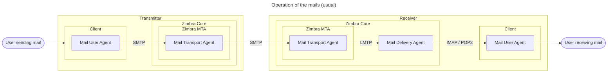
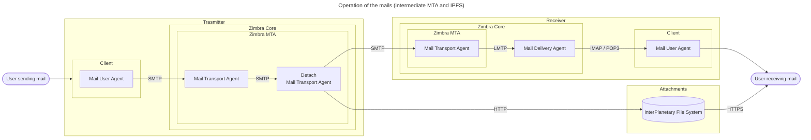

# detach-mta-doc

To show documentation about detach-mta project

## Context : A colossal daily sending of emails

'Between 2017 and 2021, nearly 300 billion emails were sent worldwide per day.' - Statistica. 2021.

In this project, we want to think about how to reduce the amount of data associated with emails, and more specifically with those containing attachments.

## Traditional method : Redundancy of attachments between data centers

Currently, attachments are contained (in base64) in the body of the emails, which means that each mailbox receiving them will store them.
Total storage footprint = weight of attachments * number of recipients

## Diagrams

### Figure 1.1: Traditional process of sending and receiving mail.

Attachments are usually stored in the recipient's delivery agent.

Abbreviations used: Simple Mail Transfer Protocol (SMTP) - Mail Transport Agent (MTA) - Mail Delivery Agent (MDA) - Mail User Agent (MUA) - Post Office Protocol (POP) - Internet Message Access Protocol (IMAP)

### Figure 1.2: DetachMTA process describing the detachment of attachments by the sender's mail transfer agent.

The attachments are no longer stored in the recipient's delivery agent, but rely on a third party storage: InterPlanetary File System (IPFS)

## Results : An email transfer agent that removes attachments before they are sent

### DetachMTA

Our solution allows to store attachments only once by developing an intermediary that detaches them from outgoing emails and hosts them on a content sharing network. Thus, only the links to the files will be sent to the different recipients, saving bandwidth and storage of the mail servers.

### Mail interface

The mail interface remains unchanged, so our solution does not interfere with the user experience.

### Dashboard

In order to avoid a negative rebound effect on the reduction of the energy impact of emails by our solution, we propose a dashboard to make the user responsible for the attachment of files to his emails.
